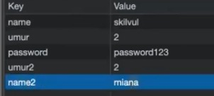
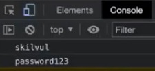
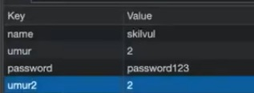
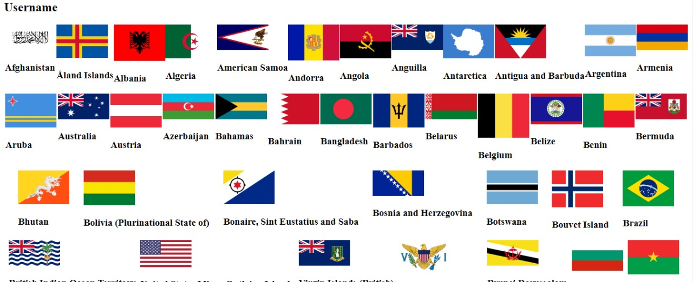

# **JavaScript**

## **1.Condisional**

Condisional Statment bertugas mengecek kondisi spesifik untuk menjalankan sebuah perintah berdasarkan kondisi yang dinilai terbaik akan dipilih (true) maka kode dijalankan, (false) maka kode tidak berjalan
//sebagai contoh alur kita saat sedang mengabil makan maka kodisi yang akan kita lakukan bagaimana?

### ***(Condisional if else)***
***contoh sederhana***
```js
if(true){
    console.log("saya masuk kerja");
    } else {
        console.log("saya tidak masuk");
    }
    //input keluar = saya masuk kerja

    // (true) melambangkan sebuah kondisi
```
***contoh dengan nilai***
```js
const nilai = 70;
if (nilai >= 80){
    console.log("nilainya A");
} else if (nilai >= 60) {
   console.log("nilainya B");
} else if (nlai >= 40){
    console.log("nilainya C");
} else {
    console.log('remidi');
}
//"nilainya B"
```
### ***(Switch Case)***
digunakan saat kondisi percabangan terlalu banyak hampir sama dengan (if else) tetapi lebih detail cara penggunaan data di setiap Swich-Case wajib memiliki nilai default
```js
const lampu = "hijau";
switch (lampu){
    case "hijau":
        console.log("Jalan")
        break;
    case "kuning":
        console.log("hati-hati")
        break;
    case "merah":
        console.log("Berhenti")
        break;
    default:
        console.log("hati-hati melintas") //boleh lewat      
}
```

## **2.Scope**
bagaimana kita dapat memproses data di dalam ruang lingkup tertentu bisa diakses/tidak

sebagai contoh ada 2 orang berada di tepat berbeda, pasti akan memikili suasana dan pemandangan berbeda pula

 

kalo didalam sebuah kodingan, code yang berada di dalam sebuah block **Curly Braces { }**  jadi bila kodingan berada dalam sebuah block maka kodingan tidak dapat diakses dari luar block tersebut.

***local scope*** bila fungsi berada diluar scope maka tidak dapat mengakses variabel yang berada didalam scope 

***global scope*** kita dapat mengakses variabel bila variabel dan fungsi tersebut berada diluar scope atau bisa juga mengakses variabel diluar scope dengan fungsi yang berada didalam scope 

 ### ***variabel luar dapat diakses dari dalam***
 Contoh;
 

 ### ***variabel didalam tidak dapat diakses dari luar***
 tidak dapat Akses 

 

 
## **3.Function**

adalah sebuah blok kode yang digunakan untuk membungkus suatu proses dengan tujuan agar mempermudah penulisan kode.

blok kode yang digunakan untuk membuangkus suatu proses agar proses tersebut tidak ditulis secara berulang kali.

***BEFORE***

***Menghitung luas persegi***
```js
let panjang = 10;
let lebar = 20;
let luas = panjang * lebar;
console.log(luas);//200

let panjang1 = 9;
let lebar1 = 20;
let luas1 = panjang1 * lebar1;
console.log(luas1);//180
```
***A) Contoh Function***

catatan; Argumen dan Parameter berguna untuk mengetahui suatu nilai/angka sebuah Function 
```js
function luasArea(widht, height) {
    return widht * height
}
console.log(luasArea(10,10));//100
console.log(luasArea(15,17));//255
console.log(luasArea(17,10));//170
console.log(luasArea(100,10));//1000
```
***B)Default Parameters***

Default paramaters digunakan untuk memberikan nilai awal/default pada parameter function.

Default parameters bisa digunakan jika kita ingin menjaga function agar tidak error saat dipanggil tanpa argumen
```js
function defaultParameter(nama = "Public"){
    return "Hello" + nama;
}

console.log(defaultParameter());//Output; "HelloPublic"
```

***C)Arrow Function***

Arrow function adalah cara lain menuliskan function. Ini adalah fitur terbaru yang ada pada ES6 (Javascript Version)

## **4.Looping**
mengulang sebuah instruksi hingga kondisi terpenuhi atau jika kondisi telah terpenuhi.

sebagai contoh; orang yang ingin berpergian pasti akan akan melihat barang bawaaanya sudah terpenuhi/tidak bila belum terpenuhi maka barang akan dicari lagi

***A)Manual Looping***
kita menulis secara manual sebuah pengulangan
```js
console.log(1)//1
console.log(2)//2
console.log(3)//3
console.log(4)//4
console.log(5)//5
```
***B)Outomatis Looping***
```js
//for(start,stop,step)
for (let i = 0; i <= 5; i++){
    console.log(i);
}//output; 1 2 3 4 5
```
 ## **5.Prototype**

 yaitu sebuah fitur bawaan javascript yang bisa ditambahkan pada sebuah properti

 A) Constructor bila kita memiliki banyak objeck dari pola data yang sama kita bisa meggunakan fitur constractor

 kita tidak bisa mengunakan fitur constractor secara langsung

 ***Memanggil Objeck yang berada pada Prototype***
```js
console.log(Object);//tidak terpanggil
console.log(Object.prototype);//terpangil
```
B) *Menthod/Function Prototyping* 

kita juga bisa menambahkan method untuk constructor yang telah kita buat Method bisa digunakan untuk semua instance object. jadi buat satu kali untuk digunakan semua instrance object

kita juga dapat menambahkan sebuah properti menggunakan Custom prototype

kita dapat menambah properti menggunakan custem properti
```js
String.prototype.repeatString = function (n) {
    return this.repeat(n);
};
console.log("Public".repeatString(2));//PublicPublic
```
 ## **6 Array**
 digunakan untuk menyimpan banyak nilai dalam satu Variabel

```js
//Memanggil sebuah nilai,
let buah = ["Jeruk","Apel","Pisang","Rambutan"]
buah.push = ("Anggur");

console.log(buah[3]);//Rambutan

// start,stop,step
for (let i = 0; i < buah.length; i++){
    console.log(buah[i]);
}//Jeruk,Apel,Pisang,Rambutan,Anggur
```

```js
// versi Parameter
let binatang = ["ikan","sapi","ajing"]
binatang.push("monyet")

function arrayBuah(arr)
{
    for (let i = 0; i < binatang.length; i++){
        console.log(binatang[i]);
    }
}
arrayBuah(binatang)//ikat,sapi,ajing,monyet
```
 ## **7.Dom(dokumen objeck model}**
 DOM berguna untuk mengakses sebuah code html atau css menggunakan JavaScript. Biasanya DOM digunakan setelah codingan selesai. Jadi DOM sendiri akan mendapat semua kontrol html dan juga css

 - Membuat HTML
 - Modifikasi CSS dan HTML
 - Modifikasi Atribut HTML

```js
// membaca title
console.log(document.title);

// mengganti nama title
document.title = "Public";
```

# ****MINGGU KE 3****

## **1).Object**

Object adalah sekumpulan list dari tipe data primitif (terkadang juga tipe data) yang menyimpan nilai dengan konsep berpasangan value. Tiap item (yang lebih dikenal dengan nama variabel) disebut dengan property, dan function disebut dengan method.

Analoginya sebuah mobil sebagai Objeck, benda mati dan benda hidup didalamnya sebagai properti/key,   

```js

// cara membuat Object
let dataObject = { key: "velue" };

```

```js
// contoh object
let preson = {
    nama: "Baharudin",
    umur: 20,
    hoby: "Melukis",
    'makanan kesukaan': 'tempe'
}
// menampilkan semua data
console.log(preson);
```

```js
// cara mengupdete object dapat dilakukan dengan 2 cara
// dot notation dan bracket

// Updete menggunakan dot (.)
student.hoby = 'memancing';

// updete data menggunakan Bracket dapat menambah sebuah data menggunkan spasi
student['address'] = 'surakarta';

// menambahkan object menggunakan variabel
let song = "pop";
student[song] = 'saya suka'//pop ; saya suka

```


## **2).Module system**

Adalah sebuah cara bagi bahasa pemrograman agar bisa menerapkan isolasi kode dari satu file terhadap file lain, serta memudahkan untuk menyertakan kode dari file lain ke dalam file yang membutuhkannya dengan cara export dan impord.


cara mengaitkan module JS ke sebuah html
```js
<!DOCTYPE html>
<html lang="en">
  <head>
    <meta charset="UTF-8" />
    <meta http-equiv="X-UA-Compatible" content="IE=edge" />
    <meta name="viewport" content="width=device-width, initial-scale=1.0" />
    <title>Document</title>
  </head>
  <body>


    <script src="index.js" type="module"></script>
  </body>
</html>
```
index js
```js
//data yang ysng telah export masuk akan di import ke index js 
import { fruit, fruitTropic } from "./fruit.js";

// cara memanggil data
console.log(fruit);
console.log(fruitTropic);

```

fruit js
```js
let fruit = ["apple", "mango", "banana"];
let fruitTropic = "avocado";
export { fruit, fruitTropic };//yang akan diexport


```

## **3).Rekursi**
Rekursi adalah proses pengulangan sesuatu dengan cara kesamaan-diri. Sebagai contohnya, saat dua cermin berada paralel antara satu dengan yang lain, gambar yang tertangkap adalah suatu bentuk rekursi tak-terbatas dalam coding function yang memanggil dirinya sendiri sampai kondisi terpenuhi.

 


 ```js
//  REKURSI
function countDown(number) {
    console.log("number rekursif", number);
    let nextNumber = number - 1;
  
    if (nextNumber > 0) {
      countDown(nextNumber);
    }
  }
  countDown(5); //akan memanggil; number reqursif 1 sampai 5


//   LOOPING
  
  for (let number = 5; number > 0; number--) {
    console.log("number looping", number);
  }
  //akan memanggil; number looping 1 sampai 5
  ```


## **4).Web Storege**
 adalah salah satu Web API yang dapat menyimpan data secara lokal pada sisi client. Berbeda dengan objek atau array, data yang disimpan pada objek atau array JavaScript bersifat sementara, dan akan hilang jika terjadi reload atau pergantian URL pada browser.


### ***Local Storage dan Session Storage***

**Local Storage**
 merupakan salah satu cara yang dapat digunakan untuk menyimpan data di web browser. Pada localStorage penyimpanan data tidak memiliki kadaluarsa, artinya data yang disimpan tetap ada meskipun browser telah ditutup.

**Session Storage**
data yang disimpan akan hilang jika browes ditutup Pada dasarnya untuk menggunakan localStorage dan sessionStorage sama, terlebih dahulu kita harus mengatur key dan value nya.




 ```js
//  penulisan local Srorage dengan key name dan velue skilvul
localStorage.setItem("name", "skilvul");
localStorage.setItem("name2", "miana");
localStorage.setItem("password", "password123");
localStorage.setItem("umur", 2);
localStorage.setItem("umur2", "2");
```

```js
// cara pemanggilan data 
const nameStorage = localStorge.getItem("name");

console.log(nameStorage);//skilvul
console.log(localStorage.getItem("password"));//password123

 ```

 ```js
// cara menghapus item localStorage
localStorage.removeItem("name2");//menghapus peritem

localStorage.clear();//menghapus semua item
 ```


## 5).asynchronous
sync/Await merupakan sebuah syntax khusus yang digunakan untuk menangani Promise agar penulisan code lebih efisien dan rapih. (Memanggil dengan jangka waktu tertentu)


async callback seperti kita sedang menunggu sebuah pekerjaan yang sedang berjalan lalu kita melakukan sebuah perkerjaan lagi untuk menggunakan waktu se efisien mungkin
```js
// async callback

const mainFunc = (number1, number2, callback) => {
    console.log(number1 * number2);
    callback();
    console.log(number1 + number2);
  };
  
  const callbackFunc = () => {
    console.log("callback");
  };
  
  mainFunc(10, 20, callbackFunc);//200 callback 30 
```

berhubungan dengan delay atau jeda waktu milisecon

```js
// setTimeOut
const p1 = () => {
  console.log("proses 1");
};

const p2 = () => {
  setTimeout(() => {
    console.log("proses 2");
  }, 5000);
};

const p3 = () => {
  p1();
  p2();
  console.log("proses 3");
};

p3();//proses yang akan dipanggil; proses 3 proses 1 proses 2
```


Promises adalah sebuah janji atau kemungkinan yang akan terjadi kedepanya( entah terjadi, ditunda ,dan dibatalkan )




```html
<!DOCTYPE html>
<html lang="en">
  <head>
    <meta charset="UTF-8" />
    <meta http-equiv="X-UA-Compatible" content="IE=edge" />
    <meta name="viewport" content="width=device-width, initial-scale=1.0" />
    <title>Document</title>
  </head>
  <style>
    #list-flags {
      display: flex;
      flex-wrap: wrap;
      justify-content: space-evenly;
    }
  </style>
  <body>
   

<!-- slide tugas 2 -->
<div id="list-flags">
 <div>
    
    <h3></h3>
 </div>
</div>


    <p>follower <span id="followers">5</span></p>


    <script src="./tugas.js"></script>
  </body>
</html>


```


```js

let listOfFlang = document.getElementById("list-flags");


  const getFlags = async () => {
    const url = "https://restcountries.com/v2/all";
  
    // melakukan fetch data
    let response = await fetch(url);
    let result = await response.json();
    // membuka paket
    result.forEach((item) => {

     listOfFlang.innerHTML += 
     
    `<div>
        
         <h3>${item.name}</h3>
     </div>`;
    });
    console.log(result);

  
  };
  
    // function async jika di dalamnya dikasih return
    // maka function ini akan bernilai sebuah promise
    // return result
  getFlags();
```